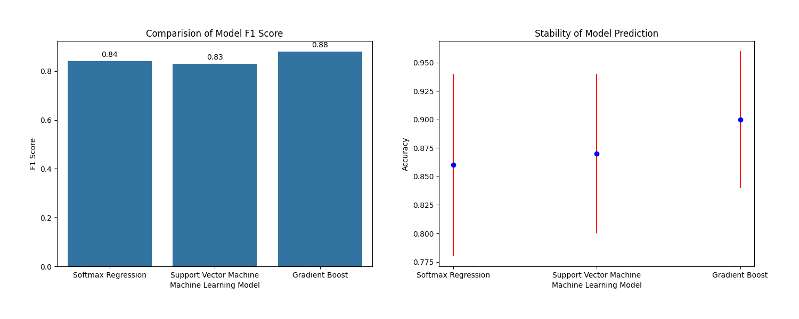

# 💤 Sleep Health and Lifestyle Dataset Analysis & Prediction

## 📌 Overview

This project focuses on analyzing sleep health and predicting sleep disorders using lifestyle and physiological data. A **Gradient Boosting Classifier** is used to classify individuals into sleep disorder categories based on various health metrics.

---

## 🚀 Features

* Data preprocessing and cleaning
* Feature engineering (e.g., blood pressure categorization)
* Categorical encoding (One-Hot + Target Encoding)
* Dimensionality reduction using PCA (95% variance retained)
* Machine learning model: Gradient Boosting Classifier
* Real-time inference pipeline for predictions

---

## 📂 Dataset Information

* **File:** `Sleep_health_and_lifestyle_dataset.csv`
* **Rows:** 374
* **Columns:** 13

### 🧾 General Variables

| Variable         | Description                             |
| ---------------- | --------------------------------------- |
| Person ID        | Unique identifier                       |
| Gender           | Male / Female                           |
| Age              | Age in years                            |
| Occupation       | Category of work                        |
| Sleep Duration   | Hours of sleep per day                  |
| Quality of Sleep | Rating (1–10)                           |
| Physical Activity Level | Minutes of exercise per day    |    
| Stress Level     | Rating (1–10)                           |
| BMI Category     | Normal, Overweight, Obese               |
| Blood Pressure   | Format: systolic/diastolic              |
| Heart Rate       | Beats per minute (BPM)                  |
| Daily Steps      | Total number of steps per day           |

### 🎯 Target Variable

| Target Variable  | Description                             |
| ---------------- | --------------------------------------- |
| Sleep Disorder   | Healthy, Insomnia, Sleep Apnea |

> Note: "None" values in *Sleep Disorder* are treated as **Healthy**.

---

## ⚙️ Methodology

### 🧹 Data Processing

* Missing values handled via imputation
* Blood pressure categorized into:

  * Normal
  * Elevated
  * Stage 1 Hypertension
  * Stage 2 Hypertension
  * Severe Hypertension
  > Note: Extraordinary record of blood pressure are treated as **Measurement Error**.

### 🔄 Encoding

- **One-Hot Encoding**: Applied to *Gender* and *BMI Category* to convert categorical variables into binary indicators, avoiding ordinal assumptions. This method is suitable for low-cardinality features.

- **Ordered Target Encoding (CatBoost Encoding)**: Applied to *Occupation*, encoding categories based on the mean target value (*Sleep Disorder*). The ordered approach reduces target leakage by computing encodings sequentially. Laplace smoothing is used to stabilize estimates for rare categories. This method is effective for high-cardinality features.

### 📉 Dimensionality Reduction

- **Principal Component Analysis (PCA)**: Reduces dimensionality while retaining 95% of the dataset’s variance. PCA transforms correlated features into a smaller set of linearly independent components, improving efficiency and reducing noise and multicollinearity.


### 🤖 Model

This project evaluates multiple machine learning models:

- **Logistic Regression**
  - Approach: Multinomial Logistic Regression using the Softmax function
  - Purpose: Outputs probability distribution across sleep disorder classes
  - Reproducibility:
    - Solver: lbfgs
    - Random state: 150

- **Support Vector Machine (SVM)**
  - Strategy: One-vs-Rest (OvR) for multi-class classification
  - Reproducibility:
    - Kernel: polynomial
    - Degree: 3 (θ<sup>3</sup>)
    - Regularization parameter (C): 1

- **Gradient Boosting Classifier**
  - Implementation: Ensemble learning using sequential decision trees
  - Reproducibility:
    - Number of estimators: 80
    - Maximum depth: 2
    - Random state: 150

## 📁 Project Structure

```
├── Sleep_health_and_lifestyle_dataset.csv
├── Training.py
├── Inference.py
├── Gradient Boosting Classifier.pkl
├── Model Features.pkl
├── One-Hot Encoding.pkl
├── Ordered Target Encoding.pkl
├── Graph.png
└── README.md
```

---

## 🛠 Installation

```bash
pip install pandas numpy scikit-learn matplotlib seaborn scipy joblib
```

---

## ▶️ Usage

### Train the Model

```bash
python Training.py
```

### Run Inference

```bash
python Inference.py
```

---

## 📊 Model Evaluation

The evaluation focuses on two key dimensions: **predictive performance (F1-Score)** and **model reliability (stability across runs)**.

### 🔍 Performance Comparison

- **Gradient Boosting** achieved the highest performance with an F1-Score of **0.88**  
- **Logistic Regression (Softmax)** followed with **0.84**  
- **Support Vector Machine (SVM)** achieved **0.83**, remaining competitive  

The use of **macro-averaged F1-score** ensures fair evaluation across all classes, regardless of class imbalance.

---

### 📈 Model Stability

- **Logistic Regression with Softmax** achieves solid accuracy (~0.86) but exhibits the highest variability, making it more sensitive to data splits  
- **Support Vector Machine** demonstrates moderate stability with slightly higher variance  
- **Gradient Boosting Classifier** shows the highest mean accuracy (~0.90) with low variance, indicating strong and consistent performance  

---

### 📉 Visualization



> The chart compares model performance (F1 Score and Confidence Interval of Accuracy Score).

---

## 💻 Tech Stack

* Python 3
* pandas
* numpy
* scikit-learn
* matplotlib
* seaborn
* scipy
* joblib

---

## 📜 License

This project is licensed under the **CC-BY (Creative Commons Attribution)** license.

---

## 📖 Citation

Do, Chi Khoa (2026). *Sleep Health and Lifestyle Dataset Analysis and Prediction*.  

🔗 [Project Link](https://github.com/Dochikhoa2006/Sleeping-Disorder-Analysis)

---

## 🙏 Acknowledgements

This README structure is inspired by data documentation guidelines from:

- [Queen’s University README Template](https://guides.library.queensu.ca/ReadmeTemplate)  
- [Cornell University Data Sharing README Guide](https://data.research.cornell.edu/data-management/sharing/readme/)  

This project utilizes the **Sleep Health and Lifestyle Dataset**, available on Kaggle:

- [Sleep Health and Lifestyle Dataset](https://www.kaggle.com/datasets/uom190346a/sleep-health-and-lifestyle-dataset)

> **Note:** Please ensure compliance with Kaggle’s terms of use when accessing and using the dataset.

---

## 📬 Contact

Chi Khoa Do - dochikhoa2006@gmail.com.   
For questions or collaboration, feel free to reach out.

