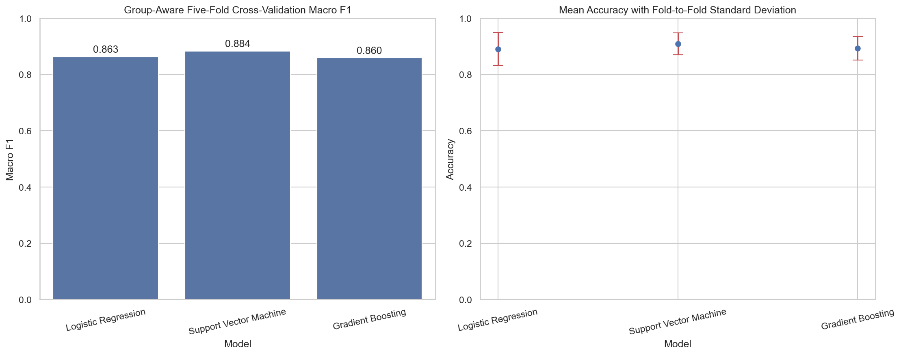

# Sleep Disorder Classification

A reproducible machine-learning project that classifies a record as
**Healthy**, **Insomnia**, or **Sleep Apnea** from sleep, lifestyle, and
physiological features.

The deployable artifact is one scikit-learn pipeline containing feature
engineering, missing-value handling, encoding, scaling, and classification.
Training and prediction therefore apply exactly the same transformations.

## Results

Models were compared with stratified, group-aware five-fold cross-validation.
Rows with identical predictive features stay in the same fold, preventing
duplicate patient profiles from appearing in both training and validation.
Selection was based on mean macro F1, which gives equal importance to all
three classes.

| Model | Macro F1 | Mean accuracy | Fold accuracy SD |
| --- | ---: | ---: | ---: |
| Logistic Regression | 0.863 | 0.891 | 0.059 |
| **Support Vector Machine** | **0.884** | **0.909** | **0.039** |
| Gradient Boosting | 0.860 | 0.893 | 0.042 |

Support Vector Machine achieved the highest mean macro F1 in this comparison
and was fitted on the full dataset for the saved pipeline. These are internal
cross-validation estimates, not results from an independent external test set.



## What Was Corrected

- The model now saves preprocessing and classification as one pipeline.
- Training and prediction use identical feature transformations.
- `Person ID` is excluded because it is an identifier, not a clinical feature.
- Blood pressure is parsed into systolic and diastolic values, and severe
  hypertension is checked before the broader stage-2 condition.
- Categorical features use an encoder that safely handles unseen values.
- Numeric and categorical missing values are imputed inside each validation
  fold, preventing preprocessing leakage.
- Identical feature rows are assigned to the same validation group to prevent
  duplicate-profile leakage.
- Model selection uses stratified, group-aware five-fold cross-validation
  instead of one train/test split.

## Repository Structure

```text
sleep-disorder-classification/
├── data/
│   └── README.md
├── models/
│   └── sleep_disorder_pipeline.joblib
├── reports/
│   └── model_comparison.png
├── src/
│   ├── train.py
│   ├── predict.py
│   └── preprocessing.py
├── tests/
│   ├── test_prediction.py
│   ├── test_preprocessing.py
│   └── test_training.py
├── .github/workflows/ci.yml
├── .dockerignore
├── .gitignore
├── Dockerfile
├── LICENSE
├── README.md
└── requirements.txt
```

## Dataset

The project uses the
[Sleep Health and Lifestyle Dataset](https://www.kaggle.com/datasets/uom190346a/sleep-health-and-lifestyle-dataset).
The local training file contains 374 records and 13 columns. Missing target
values are interpreted as `Healthy`.

The dataset is published separately under **CC0: Public Domain**. It is not
covered by this repository's MIT License. Download instructions are available
in [`data/README.md`](data/README.md); CSV files are intentionally excluded
from Git.

## Installation

Python 3.11 or newer is recommended.

```bash
git clone https://github.com/Dochikhoa2006/Sleeping-Disorder-Analysis.git
cd Sleeping-Disorder-Analysis
python -m venv .venv
source .venv/bin/activate
python -m pip install --upgrade pip
python -m pip install -r requirements.txt
```

On Windows PowerShell, activate the environment with:

```powershell
.venv\Scripts\Activate.ps1
```

## Train

Place the dataset at
`data/Sleep_health_and_lifestyle_dataset.csv`, then run:

```bash
python -m src.train
```

This command compares the three candidate models, then regenerates:

- `models/sleep_disorder_pipeline.joblib`
- `reports/model_comparison.png`

Optional paths can be supplied with `--data`, `--model-output`, and
`--report-output`.

## Predict

Run the interactive predictor:

```bash
python -m src.predict
```

For a repeatable non-interactive prediction, create `patient.json`:

```json
{
  "Gender": "Male",
  "Age": 31,
  "Occupation": "Software Engineer",
  "Sleep Duration": 7.2,
  "Quality of Sleep": 8,
  "Physical Activity Level": 60,
  "Stress Level": 4,
  "BMI Category": "Normal",
  "Blood Pressure": "120/80",
  "Heart Rate": 70,
  "Daily Steps": 8000
}
```

Then run:

```bash
python -m src.predict --input-json patient.json
```

Only load `.joblib` files from sources you trust. Joblib artifacts can execute
code when loaded.

## Tests

```bash
python -m unittest discover -s tests -v
```

GitHub Actions runs the same test command with Python 3.11 for every push and
pull request.

## Docker

Build the inference image:

```bash
docker build -t sleep-disorder-classifier .
```

Run it interactively:

```bash
docker run --rm -it sleep-disorder-classifier
```

Or provide a JSON file:

```bash
docker run --rm \
  -v "$PWD/patient.json:/tmp/patient.json:ro" \
  sleep-disorder-classifier \
  --input-json /tmp/patient.json
```

## Tech Stack

- Python
- pandas and NumPy
- scikit-learn
- SciPy
- Matplotlib and seaborn
- joblib

Exact tested dependency versions are pinned in `requirements.txt`.

## Limitations

- The dataset is small and synthetic, so reported scores may not generalize to
  real clinical populations.
- The model has not been clinically validated.
- Predictions depend on self-reported and simplified health features.
- Fold standard deviations describe variation among five correlated
  validation folds; they are not population confidence intervals or
  guarantees for future data.
- Model selection and reporting use the same internal cross-validation, so
  the comparison can be optimistic and should be confirmed on external data.

## License

The source code in this repository is licensed under the
[MIT License](LICENSE).

The dataset is a separate work distributed by its publisher under
[CC0: Public Domain](https://www.kaggle.com/datasets/uom190346a/sleep-health-and-lifestyle-dataset).
The MIT License does not apply to the dataset.

## Citation

Do, Chi Khoa (2026). *Sleep Health and Lifestyle Dataset Analysis and
Prediction*.

## Contact

Chi Khoa Do — dochikhoa2006@gmail.com
